# GMAI - Pulse

**Anomaly Detection & Insights Agent**

> Status: **Discovery / Solutioning** — this repository is a placeholder for an enterprise initiative that is still in the problem-framing and solution-design phase. Architecture, tech stack, and implementation choices are intentionally left open.

---

## Table of Contents

1. [Overview](#overview)
2. [Problem & Context](#problem--context)
3. [Scope & Stakeholders](#scope--stakeholders)
4. [Proposed Solution](#proposed-solution)
5. [Anomaly Taxonomy](#anomaly-taxonomy)
6. [Expected Value](#expected-value)
7. [High-Level Conceptual Architecture](#high-level-conceptual-architecture)
8. [Open Decisions (To Be Solutioned)](#open-decisions-to-be-solutioned)
9. [Roadmap](#roadmap)
10. [Repository Structure (Planned)](#repository-structure-planned)
11. [Contributing](#contributing)
12. [Glossary](#glossary)

---

## Overview

**GMAI - Pulse** is an enterprise-grade **Anomaly Detection & Insights Agent** designed to continuously monitor digital marketing, SEO/GEO, MarTech, and customer-experience signals across the global digital estate, automatically surface meaningful deviations, and correlate them with potential root causes (deployments, tagging changes, campaign launches, content updates, platform incidents).

The goal is to shift from **reactive diagnosis** (issues noticed after the fact) to **proactive, explained alerts** that describe *what changed, where, when, and what likely caused it*.

## Problem & Context

Today, issues affecting revenue, traffic, and customer experience are often discovered **after** the impact has occurred. Specifically:

- Sudden **SEO traffic drops** or **unexplained traffic spikes** can be identified later than ideal.
- It is **difficult to correlate anomalies** with the events that likely caused them — deployments, campaign launches, tagging changes, CMS or schema updates.
- **Insights live in silos** across SEO, GEO, analytics, MarTech, social listening, and contact-center tooling, which delays diagnosis and response.
- Teams spend disproportionate time on **manual reporting and triage** instead of optimization and growth.

## Scope & Stakeholders

GMAI - Pulse is initially scoped to support the following functional areas and use cases:

| Stakeholder Function | Primary Interest |
|---|---|
| **Demand Generation** | Health of destination URLs and conversion paths |
| **SEO / GEO** | Ranking, Share of Voice (SoV), and organic visibility impact |
| **Measurement & Insights** | Reporting accuracy, KPI integrity, executive narrative |
| **MarTech** | Tagging health, implementation fixes, data collection reliability |

Footprint: configurable per site, brand, region, and KPI; intended to scale across the global digital estate.

## Proposed Solution

Configure anomaly-detection logic across the digital estate to detect, classify, correlate, and explain deviations — then route them to the right owner with enough context to act.

Core capability pillars:

1. **Signal ingestion** from SEO, GEO, web analytics, MarTech / tagging, social listening, VOICE / contact center, and deployment / release systems.
2. **Anomaly detection** using a mix of statistical baselines, seasonality-aware models, and KPI-aware thresholds — tuned per site and per metric.
3. **Correlation & root-cause hinting** by joining anomalies with recent deployments, tagging changes, content updates, and campaign events on a shared timeline.
4. **Insights agent** that summarizes *what changed, where, when, likely why, and who should look at it* in natural language.
5. **Routing & workflow** into the channels stakeholders already use (e.g., email, chat, ticketing).

## Anomaly Taxonomy

GMAI - Pulse will track two broad classes of anomalies:

### 1. Operational Anomalies (Data & Platform)

Issues that disrupt data integrity, site functionality, or measurement reliability — typically caused by technology or implementation failures.

- Broken or missing tags
- Data collection issues (e.g., consent misfires, event loss, schema changes)
- IT / platform issues (outages, latency, failed deployments)
- New implementation implications from releases, tagging, or CMS updates

### 2. Business & Customer Experience Anomalies

Business-specific, KPI-driven deviations in customer behavior and experience, aligned to core business KPIs.

- Spikes or drops in visitor activity and site behavior
- Call center activity / **VOICE** signals (call volume and sentiment shifts)
- Social listening anomalies indicating emerging customer issues or sentiment changes

## Expected Value

- **Protect revenue and media efficiency** by catching leaks, misfires, and underperforming experiences sooner.
- **Reduce reporting effort** across SEO/GEO, paid media, executive reporting, and digital analytics.
- **Faster, calmer triage** by surfacing issues promptly with enough context for the right owner to act.
- **Build an institutional memory** of anomalies, causes, and resolutions to accelerate future diagnosis.

## High-Level Conceptual Architecture

The diagram below is a **conceptual sketch**, not a committed design. It exists to anchor solutioning conversations.

```mermaid
flowchart LR
    subgraph Sources["Signal Sources"]
        A1[Web Analytics]
        A2[SEO / GEO Tools]
        A3[MarTech / Tagging]
        A4[Social Listening]
        A5[VOICE / Contact Center]
        A6[Deployments / Releases]
        A7[CMS / Content Changes]
    end

    subgraph Ingest["Ingestion & Normalization"]
        B1[Connectors]
        B2[Schema / Metric Catalog]
    end

    subgraph Detect["Detection & Correlation"]
        C1[Anomaly Models]
        C2[Event Correlation]
        C3[Root-Cause Hints]
    end

    subgraph Agent["Insights Agent"]
        D1[Summarization]
        D2[Prioritization]
        D3[Routing]
    end

    subgraph Consumers["Consumers"]
        E1[Demand Gen]
        E2[SEO / GEO]
        E3[Measurement & Insights]
        E4[MarTech]
    end

    Sources --> Ingest --> Detect --> Agent --> Consumers
```



## Open Decisions (To Be Solutioned)

This section is intentionally explicit — these decisions are **not yet made**. PRs and design docs proposing options are welcome.

- **Detection approach:** statistical baselines vs. ML models vs. hybrid; per-metric vs. per-site tuning strategy.
- **Tech stack:** cloud platform, data store, streaming vs. batch, orchestration framework.
- **Agent framework:** which LLM / agent runtime powers the Insights Agent; prompt vs. fine-tune vs. retrieval strategy.
- **Connector strategy:** build vs. buy for each source system; auth and data-residency constraints.
- **Alerting & routing:** channels (email, chat, ticketing), severity model, on-call vs. async patterns.
- **Governance:** data privacy, PII handling, consent compliance, access control, audit.
- **Evaluation:** how we measure precision/recall of anomalies, MTTR improvement, and business impact.
- **Operating model:** who owns the platform, who owns per-site configuration, SLAs.

## Roadmap

A directional, non-committed sequence:

- **Phase 0 — Discovery (current).** Stakeholder interviews, source inventory, KPI catalog, success metrics.
- **Phase 1 — Proof of Value.** Narrow pilot on a small site set and a focused anomaly class (e.g., tagging health).
- **Phase 2 — Expansion.** Broaden site coverage, add correlation with deployments and campaigns, introduce the Insights Agent surface.
- **Phase 3 — Scale.** Portfolio-wide rollout, self-serve configuration, full routing into stakeholder workflows.
- **Phase 4 — Optimization.** Feedback loops, model tuning, anomaly knowledge base, executive reporting.

## Repository Structure (Planned)

The layout below is illustrative and will evolve once the solution direction is chosen.

```
gmai-pulse/
├── docs/                # Design docs, ADRs, stakeholder notes
│   ├── adr/             # Architecture Decision Records
│   └── discovery/       # Interviews, KPI catalog, source inventory
├── connectors/          # Source-system integrations (TBD)
├── detection/           # Anomaly models and rules (TBD)
├── agent/               # Insights Agent prompts, tools, evaluation (TBD)
├── infra/               # IaC, environments (TBD)
├── tests/
└── README.md
```

## Contributing

While the project is in discovery, contributions should focus on **shaping the problem and the solution**, not code:

1. Open an issue describing the gap, idea, or decision to be made.
2. For significant choices, propose an **ADR** under `docs/adr/` using a short *Context → Decision → Consequences* format.
3. Tag the relevant stakeholder function in discussions.

> **Note:** Please do not include confidential business data, internal URLs, customer information, credentials, or other sensitive material in issues, PRs, or committed files. Use placeholders or aggregated examples instead.

## Glossary

- **GEO** — Generative Engine Optimization; visibility in AI-generated answer surfaces.
- **SoV** — Share of Voice.
- **VOICE** — Contact-center voice signals (call volume, sentiment, topics).
- **MarTech** — Marketing technology stack (tagging, analytics, consent, etc.).
- **MTTR** — Mean Time To Resolution.
- **ADR** — Architecture Decision Record.

---

*GMAI - Pulse is an internal enterprise initiative. This README is a living document and will evolve as the solution is defined.*
