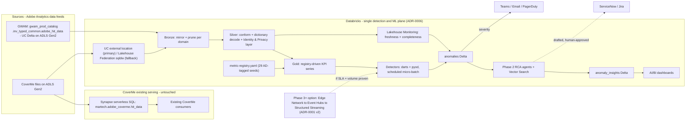
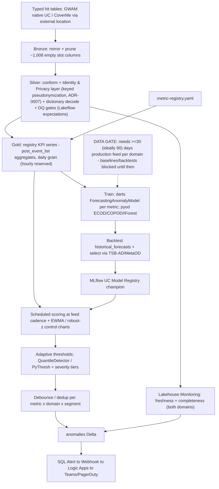
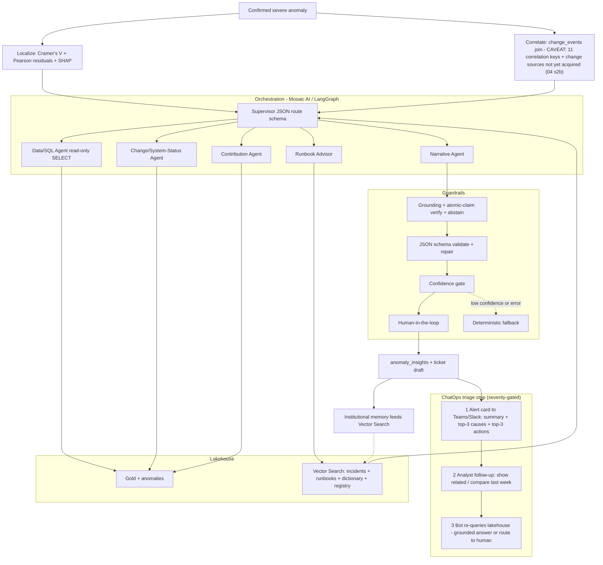
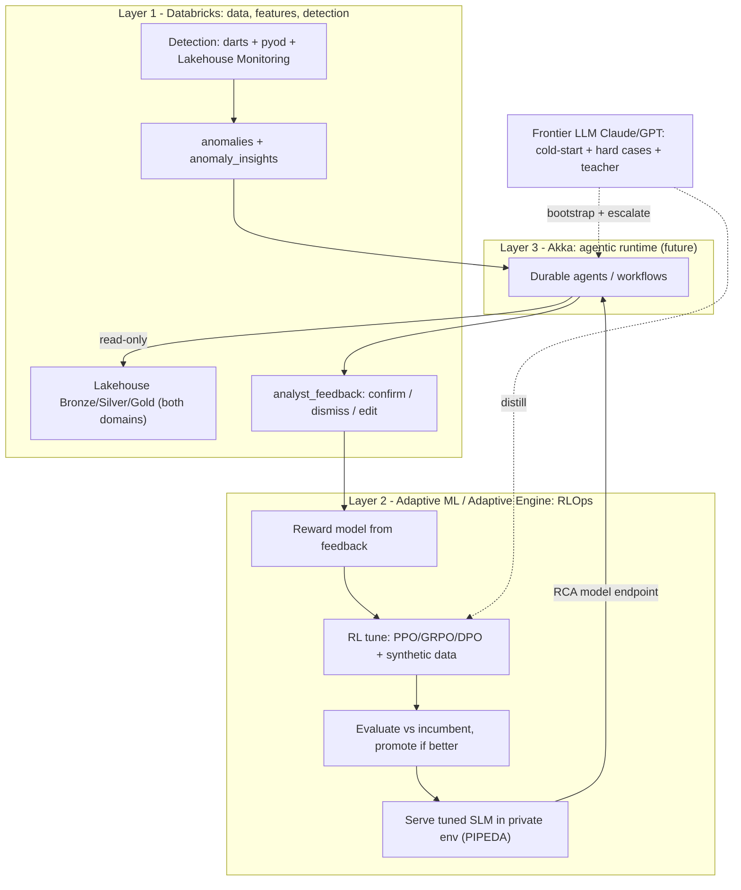
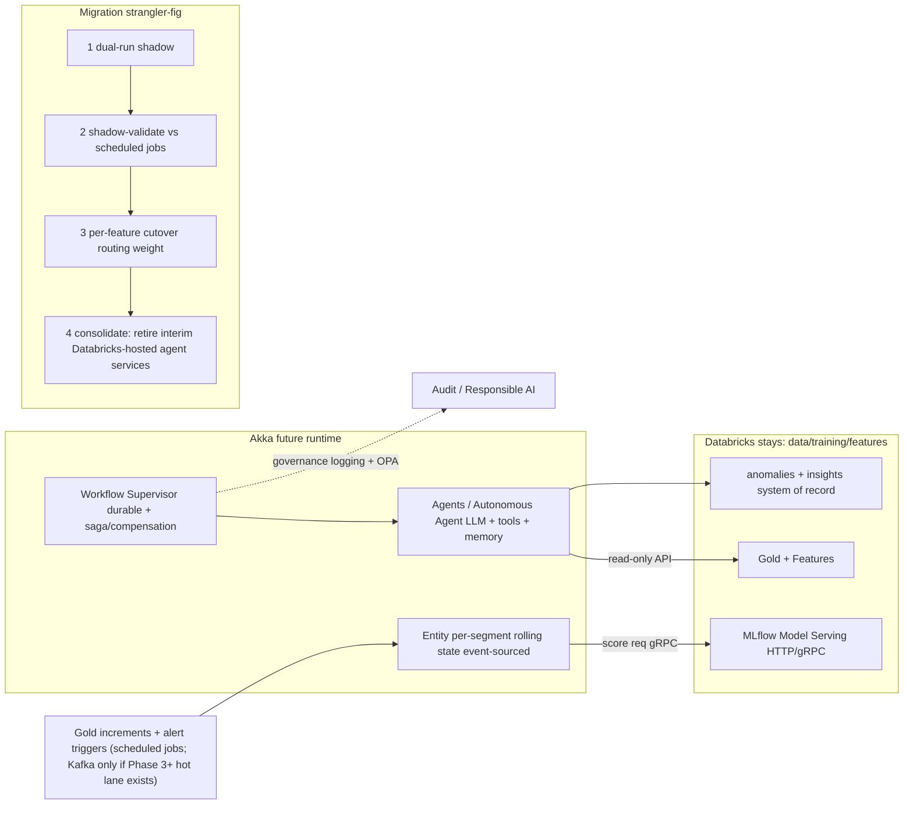

# 06 — Diagrams (Mermaid) + Lucidchart Import Guide

> **Five diagrams** covering the end-to-end two-source architecture, Phase-1 detection, Phase-2 RCA +
> ChatOps, the three-layer platform + improvement flywheel, and the Akka target state + migration. They
> render natively in **GitHub** and **VS Code** (Mermaid preview), and import into **Lucidchart**.
> Architecture context: [02](02-solution-architecture.md); what changed on 2026-07-02:
> [10-data-profile-alignment.md](10-data-profile-alignment.md).

Reduced from the previous ten-diagram set — the prior research (Perplexity explicitly, Gemini implicitly)
converges on ~4–5 core views, and the old set redrew the same lanes repeatedly:

| Kept | Absorbs (old) | Rationale |
|---|---|---|
| **D1** end-to-end hero | old ① + top level of ②③⑧ | one authoritative system view |
| **D2** Phase-1 detection | old ②③⑧ detail | offline + online are now one batch-first pipeline |
| **D3** Phase-2 RCA + ChatOps | old ④⑤⑥ | agent topology, guardrails, and triage flow belong together |
| **D4** platform + flywheel | old ⑨⑩ | the flywheel *is* Layer 2's loop — one picture |
| **D5** Akka target + migration | old ⑦ | unique content, updated to batch-first |

## How to render / import

- **GitHub / VS Code:** render automatically in Markdown preview (VS Code: "Markdown Preview Mermaid Support").
- **mermaid.live:** paste a block (without the ```` ```mermaid ```` fences) to export PNG/SVG.
- **Lucidchart:** use Lucidchart's **Mermaid import** — *Insert → Diagram/Shape → Mermaid* (or the Mermaid
  shape via the marketplace; exact menu varies by version). Paste the diagram body **without** the
  ```` ```mermaid ```` fences, then Import; Lucidchart lays it out as editable shapes.
- **draw.io / diagrams.net (alternative):** *Arrange → Insert → Advanced → Mermaid*.

**Lucid shape conventions (apply after import):** cylinders = data stores (Delta tables, ADLS, Vector
Search) · rectangles = services/compute · diamonds = gates/decisions (severity, guardrails, identity/privacy gate) ·
lightning bolt = alerts/notifications · dashed borders = future/optional components (hot lane, Akka) ·
one swimlane per concern (Sources / CoverMe serving / Databricks plane / Consumers).

Each diagram below is self-contained — copy from the first line inside the fence to the last.

---

## D1 — End-to-end reference architecture (two sources, one Databricks plane)



*Both domains share one Adobe hit schema and one pipeline; CoverMe's Synapse surface keeps serving its
current consumers while Databricks reads the same ADLS files. The streaming hot lane is a dashed future
option, not a Phase-1 component.*

---

## D2 — Phase 1: batch-first detection pipeline (offline + online in one)



*One pipeline serves both planes: the "online" mode is the same scoring path scheduled at feed cadence
([ADR-0001 v2](adr/adr-0001-near-real-time-microbatch.md)). Intraday activates only when the data gate
clears and volume is confirmed.*

---

## D3 — Phase 2: RCA agents + guardrails + ChatOps triage



*Merges the old agent-topology, offline-RCA, and ChatOps-sequence diagrams. The change-event join carries
an explicit caveat until deployment/campaign sources and the 11 missing keys exist.*

---

## D4 — Three-layer platform + continuous-improvement flywheel



*Databricks trains/detects, Adaptive ML tunes+serves the RCA model, Akka runs the agents — and every
triaged anomaly becomes training signal, closing the flywheel (see [07](07-adaptive-ml-integration.md)).*

---

## D5 — Akka target state + strangler-fig migration



*Akka fronts the batch-first services; the data/training plane never leaves Databricks. Correctness =
durable execution + at-least-once + idempotency/saga — not "exactly-once"
([ADR-0004](adr/adr-0004-akka-migration-strategy.md)).*

---

*D1 is the executive/architecture view; D2–D3 are the Phase-1/Phase-2 working views; D4–D5 are the
platform-strategy views (Adaptive ML flywheel, Akka future state). All five import into Lucidchart via
Mermaid import; apply the shape conventions above after import.*
