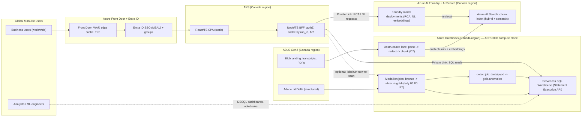

# 13 — Global Serving Topology: React/AKS Surface, Azure AI Foundry & the Unstructured Data Lane

**Date:** 2026-07-09 · **Status:** Accepted (decisions in [ADR-0008](adr/adr-0008-global-serving-and-genai-plane.md))

Refines the target-state platform around three enterprise facts that post-date the original package:
(1) Manulife already runs a **React/TypeScript AI/BI frontend** (hosting target **AKS**) that must be the
business-user surface for this project; (2) **Azure AI Foundry** is the enterprise-standard Gen-AI plane;
(3) scope now includes **unstructured data** (call/chat transcripts + feedback, policy/product PDFs)
landing in **Azure Blob / ADLS Gen2**, consumed by **global Manulife users**. Databricks remains the sole
data + detection compute plane ([ADR-0006](adr/adr-0006-unified-databricks-compute-plane.md)); the daily
medallion + detect job built under `databricks/` is unchanged and is the substrate this document serves.

---

## §1 What changes vs the existing package

| Area | Was (docs 02/05, ADR-0003) | Now (this doc + ADR-0008) |
|---|---|---|
| Business-user surface | Databricks SQL / AI-BI dashboards + Power BI ([02 §5](02-solution-architecture.md)) | **Enterprise React/TS app + Node/TS BFF on AKS**; DBSQL dashboards remain for analysts/engineers only |
| Gen-AI platform | Mosaic AI Agent Framework primary; Foundry = "Azure-plane alternative" ([ADR-0003](adr/adr-0003-genai-platform-and-guardrails.md)) | **Azure AI Foundry primary** (Agent Service + Responses API); ADR-0003's guardrails/eval requirements carry over **unchanged** |
| RAG store | Mosaic AI Vector Search | **Azure AI Search** (Foundry-native retrieval) |
| Corpus | Incidents + runbooks + dictionary + registry ([05 §A.3](05-genai-and-akka.md)) | + **transcripts/feedback + policy/product PDFs** via the new unstructured lane (§4) |
| Reach | Unstated (single-tenant analyst tooling) | **Global users, single Canadian data region**, Azure Front Door edge ([11 §5](11-privacy-identity-governance.md)) |

Unchanged: batch-first daily cadence ([ADR-0001](adr/adr-0001-near-real-time-microbatch.md)), the
detector stack (darts/pyod semantics as built in `detect/` + `databricks/`), keyed pseudonymization at
Bronze→Silver ([ADR-0007](adr/adr-0007-identity-privacy-layer.md)), Adaptive ML as the later
model-tuning loop ([ADR-0005](adr/adr-0005-model-tuning-adaptive-ml.md) — Foundry hosts the v1 models;
the Adaptive-tuned SLM slots behind the same BFF interface when the feedback loop exists).

## §2 Target topology (D6)

*D6 — one Canadian data region; global users enter only through Front Door + Entra; the BFF is the sole
trust boundary between the app and the data/Gen-AI planes.*

## §3 Serving layer (structured reads + "predictions")

- **BFF on AKS (Node/TS, matches the app stack).** Entra **Workload Identity** federates the pod to a
  least-privilege service principal holding UC grants on `gmai_pulse_gold` only; residual secrets via
  **Key Vault CSI**; **Private Link** to the workspace. The browser never holds a Databricks credential.
- **Reads:** Statement Execution API (or `@databricks/sql`) against a **2X-Small auto-stop serverless
  warehouse** over `gold.kpi_daily`, `gold.anomalies`, `gold.run_meta`. The tables are tiny and refresh
  once daily, so the BFF **caches responses keyed on the newest `run_meta.run_id`** and serves cached
  aggregates all day — the main latency/cost lever, and what makes global access viable from one region.
- **"Predictions" are precomputed.** The 06:00 job already wrote anomalies + `expected` values; the app
  reads them (ADR-0001 batch honesty). Optional on-demand re-scan for a custom window/segment = BFF
  triggers a **parameterized `jobs/run-now`** and polls — same detection code, no parallel logic.
- **Write-back:** analyst/business triage (`status`, `reconciled` — preserved by the detect MERGE) goes
  through a BFF endpoint into a governed feedback table, never a direct client write. This is the same
  feedback stream ADR-0005 later consumes for RL tuning.
- **Role model:** Entra groups drive BFF authZ (mirrors [11 §7](11-privacy-identity-governance.md):
  executive views get aggregates only; no raw hit-level data is ever served to the app).

## §4 Unstructured data lane (D7) — transcripts + PDFs

Same medallion discipline as the structured feed; Databricks stays the parsing/compute plane
(ADR-0006), Azure AI Search is the retrieval index (ADR-0008).

```mermaid
flowchart LR
    subgraph LAND["ADLS Gen2 landing (UC external location)"]
        RAWT["transcripts/ (JSON, TXT)"]
        RAWP["docs/ (PDF)"]
    end
    subgraph BRZ["Bronze"]
        MAN["file manifest Delta (path, hash, source, ingested_at)"]
        VOL["raw bytes referenced in place (UC Volume path)"]
    end
    subgraph SLV["Silver"]
        PRS["parse: Document Intelligence (PDF), transcript normalizer"]
        PII["PII redaction / pseudonymization (ADR-0007 gate)"]
        CHK["chunk + metadata (doc_id, source, lang, effective_date)"]
    end
    subgraph GLD["Gold"]
        CTAB["chunk Delta table (governed source of truth)"]
    end
    subgraph IDX["Azure AI Search"]
        EMB["embeddings (Foundry embedding model)"]
        IX["hybrid index: vector + keyword + semantic ranker"]
    end
    RAWT --> MAN
    RAWP --> MAN
    MAN --> VOL --> PRS --> PII --> CHK --> CTAB
    CTAB --> EMB --> IX
    CTAB -.->|erasure by doc_id rebuilds index| IX
```

*D7 — the index is a **projection** of the gold chunk table; rebuildable at any time, so governance,
lineage, and erasure live in Delta/UC, not in the index.*

- **Ingestion:** Auto Loader over the landing paths with `trigger(availableNow)` inside the same daily
  job family (batch-first; continuous forbidden per ADR-0001). Landing convention:
  `abfss://gmai-pulse-landing/<domain>/<source>/<yyyy>/<mm>/<dd>/...`.
- **Privacy is the hard gate, in this order:** transcripts are the most sensitive source in the project —
  **PII detection/redaction runs before silver** (Azure AI Language PII / Presidio in the Databricks job),
  speaker identities pseudonymized with the same Key Vault HMAC key family as ADR-0007; raw bytes stay in
  the bronze volume with restricted ACLs; **only redacted chunks** reach gold and the index. Erasure =
  delete chunks by `doc_id` in Delta, then rebuild/patch the index (D7 projection property).
- **Corpus registry (config-not-code):** a `corpus-registry.yaml` mirroring `metric-registry.yaml` —
  one entry per source (owner, path glob, parser, redaction profile, retention, index name). Adding a
  source is a registry row, not new code.
- **What it feeds:** v1 = RAG grounding for RCA narratives and app Q&A (§5). Later: transcript-derived
  *signals* (complaint/sentiment rates) can become registry metrics scored by the existing detector —
  that is a Phase-3 extension, not v1. Note the [04 §2b](04-phase2-investigation-insights.md)
  change-event sources (deploy logs, tickets) remain **unacquired**; this lane gives them a landing path
  but does not remove that Phase-2 entry criterion.

## §5 Gen-AI plane on Foundry

- **Models:** Foundry deployments (Canadian region, private endpoint) for chat/RCA + embeddings.
  **ADR-0003's guardrails transfer verbatim** — grounding on retrieved evidence, atomic-claim
  verification with abstention, JSON output validated against the `anomaly_insights` schema, confidence
  gating, human-in-the-loop, deterministic fallback, full audit logging. Platform changed; contract didn't.
- **Grounding:** structured context (anomaly row, KPI window, denominators) fetched by the BFF from gold
  and injected into the prompt; unstructured evidence retrieved from **AI Search** (Foundry "on your
  data" / Agent Service tools). Output lands in `anomaly_insights` (Delta) and renders in the React app
  beside the chart.
- **NL analytics fork resolved:** fixed dashboards use **plain parameterized SQL — no LLM**; free-text
  Q&A over data goes Foundry → (schema-grounded NL→SQL with read-only validation) or is deferred; the
  Genie Conversation API is **not** used (single Gen-AI plane; see ADR-0008 alternatives).
- **Cost posture per ADR-0003:** RCA invoked only on confirmed **major+** anomalies; narratives cached
  next to the anomaly row (batch-generated after the 06:00 detect run, so most reads hit precomputed text).

## §6 Global access & residency

- **Single Canadian data region** for ADLS, Databricks, Foundry, AI Search — satisfies
  [11 §5](11-privacy-identity-governance.md) (Law 25/PIPEDA residency; any non-Canadian processing
  requires an equivalency assessment, which this design avoids entirely).
- **Global users** ride **Azure Front Door**: edge-cached SPA assets + WAF + TLS; API calls terminate at
  the BFF in Canada. Daily-batch data + `run_id` caching means intercontinental latency is a
  one-round-trip concern, not a data-locality one. Multi-region **data** planes (per-region domains with
  their own medallion) remain a later extension — the pipeline is already config-not-code per domain.
- **PIA before production** and the 24-column PII gate ([10 §3](10-data-profile-alignment.md)) extend to
  the transcript corpus (new DPIA scope item).

## §7 Phasing

| Phase | Ships | Gate |
|---|---|---|
| v1 | React app reads gold via BFF (dashboards, anomaly inbox, freshness); precomputed RCA narratives on major+ anomalies; PDF corpus indexed | Catalog + SP provisioning; PIA update |
| v1.1 | Transcript corpus (redaction pipeline proven on sample); triage write-back | PII review of transcript source |
| v2 | Free-text NL Q&A; on-demand re-scan; change-event corpus | NL→SQL guardrails; 04 §2b key acquisition |
| v3 | Adaptive-tuned SLM behind the BFF (ADR-0005); transcript-derived metrics in the registry | Feedback volume; backtest |

---
*Cross-references: decisions recorded in [ADR-0008](adr/adr-0008-global-serving-and-genai-plane.md);
amends the platform choice in [ADR-0003](adr/adr-0003-genai-platform-and-guardrails.md); topology D6/D7
complement [06-diagrams.md](06-diagrams.md) D1–D5.*
